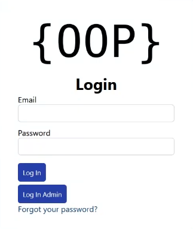
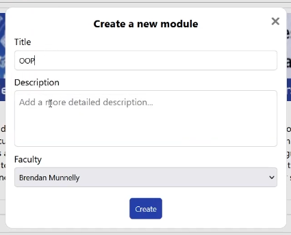
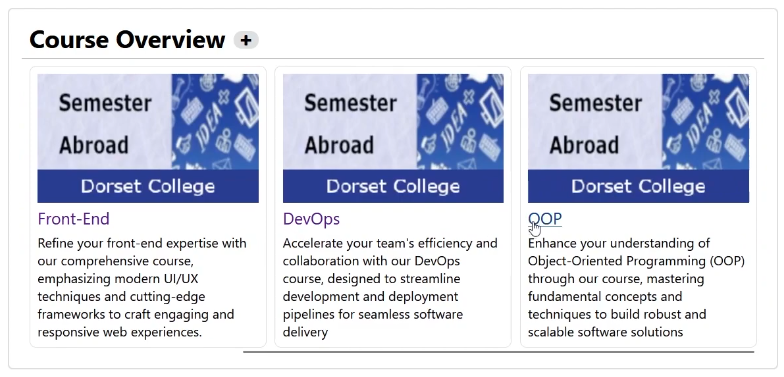
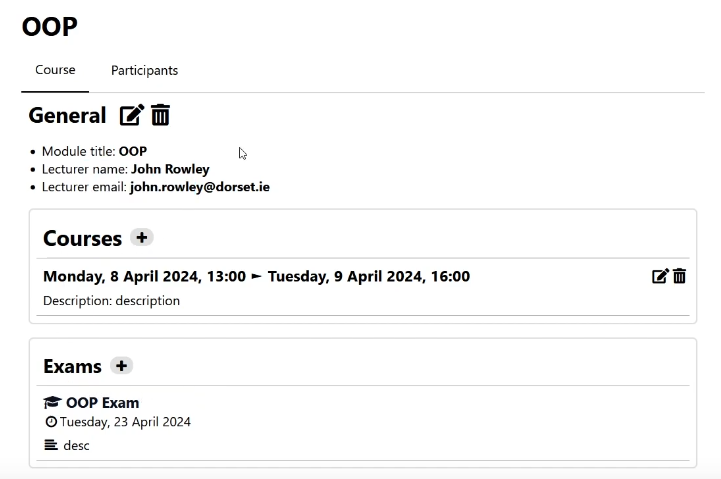
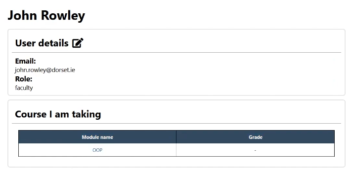
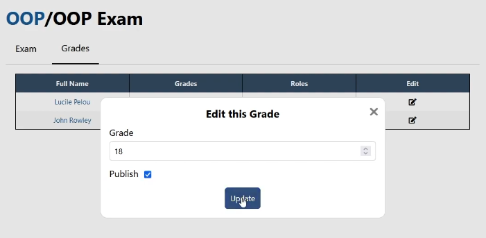

# LexiaDorset - OOP - Virtual Global College

<div>
  

  
  
    
    
    
</div>

## Installation

You can access to the website with this link: https://lexiadorset.github.io/oop-moodle-like/dist

If you want to dev:

1. Clone this repository :
   ```bash
   git clone https://github.com/LexiaDorset/oop-moodle-like.git

2. The first time you want to launch the website you have to do ```npm install``` in the root of the project

3. You can launch the website with Live server in visual studio code or with npm run dev in the root of the project

## Demo







